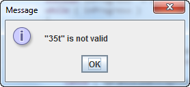

# Assignment 04

## Description ##
For this assignment you will develop two classes: OpCanceledException and the utility 
class Utils.

## Details ##

### public class OpCanceledException extends Exception ###
This class simply extends Exception; it contains no methods or fields.

### public class Utils ###
This class contains one method, askInt.

### public static int askInt( int min, int max ) throws OpCanceledException ###
This method will use JOptionPane.showInputDialog to ask the operator to enter 
an integer between min and max. The message displayed in the dialog must be "Enter 
an integer between min and max". For example, askInt( 10, 20 ) will display the dialog 
shown below:

If the operator cancels the operation, throw an OpCanceledException. Otherwise convert 
the operator's input to an int, and verify that it is between min and max. If the operator's 
input is invalid use JOptionPane.showMessageDialog to display an error message; the error 
message must contain the operator's input in quotes. For example, if the operator enters 
"35t" you must display the error message shown below:

After displaying the error message, continue to prompt the operator, using 
JOptionPane.showInputDialog, until the operator enters valid data or cancels the operation.

If the operator input passes validation, return the converted integer.

Note: it is not necessary to go to extraordinary lengths to write an automated JUnit test 
to exercise your project. It suffices to write a JUnit test that displays the given dialogs 
and waits for the operator to enter test values.
